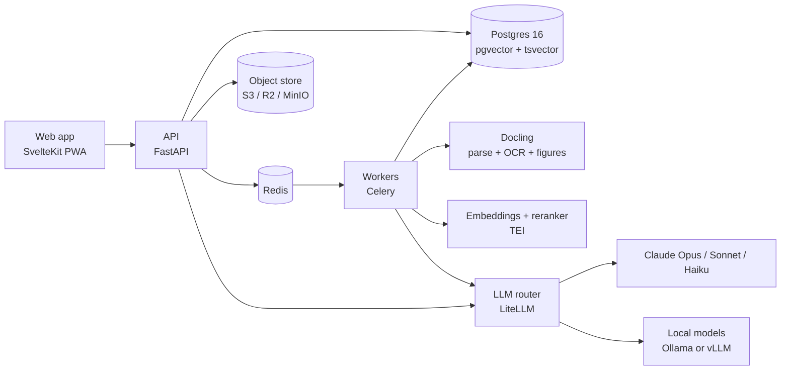
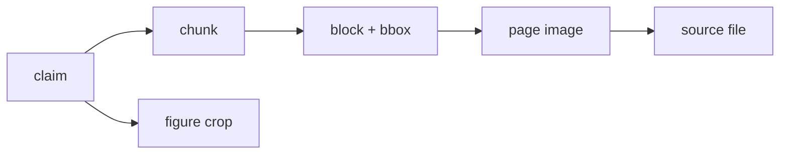
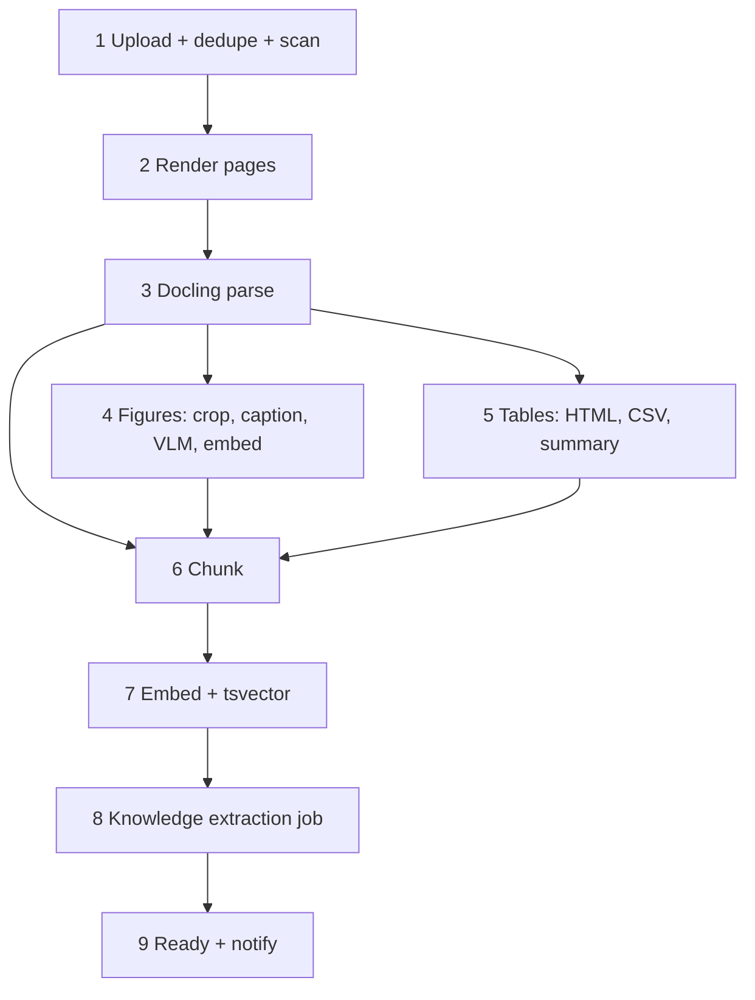

# FCPS Radiology Brain OS — Coding-Agent Implementation Spec

Sep 24, 2026 · @Dr Ahmed Hesham

## 1. Product definition and non-negotiables

Build one codebase, codename `radbrain`, that runs as a personal self-hosted instance and as a multi-tenant SaaS serving thousands of FCPS-II Diagnostic Radiology candidates. A student uploads PDF, DOCX, PPTX and image material; the system turns it into a provenance-linked knowledge graph, a figure bank, an exam-date-driven study plan and an assessment engine (SBA MCQ, SEQ, image cases, viva).

**Two deployment modes, one product**

| Mode | Tenancy | Who | Infra |
| --- | --- | --- | --- |
| Personal | Single tenant, `solo` compose profile | Founder / one candidate | One VPS or workstation, optional local GPU |
| SaaS | Multi-tenant, org + user | Many students, cohorts, institutions | Kubernetes or managed containers, managed Postgres |

**Roles**

| Role | Can |
| --- | --- |
| Student | Upload own sources, study, take assessments, chat with tutor over own library + Core Library |
| Content editor | Author and review Core Library notes, questions, figure annotations; approve AI-generated bank items |
| Org admin | Manage seats, cohorts, exam dates, analytics for their organisation |
| Superadmin | Tenants, billing, feature flags, model routing, cost caps |

**Non-negotiables (every milestone is tested against these)**

1. Provenance on every claim: source → page → block or figure bounding box. Tutor answers with no citation are rejected by the guardrail layer.
2. Tenant isolation: a user's uploads, embeddings, extracted claims and generated questions are never visible to another user or tenant. Enforced by Postgres row-level security, not application code alone.
3. Exam date first: onboarding captures the exam date before anything else; every plan, session and reminder derives from days-remaining.
4. Figures are first-class records with captions, VLM descriptions, page provenance and their own retrieval path.
5. Grading is against the source, not against a note. A note that conflicts with its source raises a `KNOWLEDGE_CONFLICT` flag instead of training the student on it.
6. Provider-agnostic LLM layer with per-tenant cost caps and a local-model fallback.
7. Every long operation is a resumable, idempotent job with visible step status.
8. Radiology-safe rendering: page images and figure crops are served at original resolution with zoom; no lossy downscale for study views.

**Content and legal boundaries**

- Uploaded textbooks are the student's own copies and stay inside their tenant. The product never redistributes them.
- The shared Core Library (curriculum notes, question bank, figure teaching sets) contains only content the company authored or licensed. AI drafts derived from a student's upload are not promoted to the Core Library.
- Not a medical device; study-only disclaimer in onboarding and in every generated report.
- GDPR-style data rights: export and delete per user within 30 days, automated.

**Out of scope for v1**

- DICOM viewer, PACS or worklist integration
- Native mobile apps (PWA first; wrapper later)
- Social or community features

## 2. Architecture and stack

One Python backend, one SvelteKit frontend, one Postgres. No Obsidian, no Second Brain OS fork, no separate RAG product: the engine below replaces all of them, and Obsidian export is a later optional feature.



Requests hit the API; anything slower than 2 s becomes a job on Redis, run by workers that write results to Postgres and object storage. The web app streams job progress and chat over SSE.

**Stack decisions**

| Layer | Choice | Why |
| --- | --- | --- |
| Frontend | SvelteKit 2 + TypeScript + Tailwind, PWA | Team familiarity; PWA covers mobile in v1 |
| API | Python 3.12, FastAPI, Pydantic v2, SQLAlchemy 2 async, Alembic | Docling, FSRS, LLM SDKs are Python-native; one backend language |
| Workers | Celery 5 on Redis, `acks_late`, idempotency keys, step table in Postgres | Durable enough for v1; Temporal is the documented upgrade path |
| Database | PostgreSQL 16 + pgvector (HNSW) + tsvector, row-level security | Hybrid search, graph and app data in one store; RLS for isolation |
| Object storage | S3-compatible: MinIO (dev/solo), Cloudflare R2 or S3 (SaaS) | Originals, page PNGs, figure crops, exports |
| Parsing | Docling (layout, table structure, OCR, picture extraction, picture description) | Best open parser for figure-heavy textbooks; DoclingDocument JSON keeps bboxes |
| Text embeddings | `bge-m3` via Hugging Face text-embeddings-inference; API alternative behind the same interface | Strong multilingual dense + sparse; self-hostable |
| Image embeddings | SigLIP via TEI or a small service | Figure-to-figure similarity, image search |
| Reranker | `bge-reranker-v2-m3` via TEI | Cheap precision boost on top-50 |
| LLM router | LiteLLM proxy with named routes: `reason`, `extract`, `classify`, `vision`, `local` | Swap providers by config; per-tenant budgets and fallbacks |
| Models (current, keep in config) | `reason` = Claude Opus 5.5 · `extract`/`vision` = Claude Sonnet 5 · `classify` = Claude Haiku 4.5 · `local` = Qwen2.5-VL or Llama via Ollama/vLLM | Opus for reasoning, Sonnet for extraction and formatting, Haiku for routing and tagging |
| Auth | OIDC: Keycloak self-hosted by default; any OIDC provider pluggable | SSO-ready for institutions |
| Billing | Stripe subscriptions and org seats | Already in use elsewhere |
| Realtime | SSE for chat tokens and job progress | Simpler than websockets behind proxies |
| Observability | OpenTelemetry → Grafana stack; Sentry; Langfuse for LLM traces | Cost and quality per request |

**Scale-out path (do not build in v1)**

- Search: move to OpenSearch or Vespa only past \~50 M chunks.
- Graph: Postgres node/edge tables with recursive CTEs; Apache AGE if traversal depth exceeds 4.
- Workers: Celery → Temporal when workflows need human-in-the-loop waits longer than 24 h.

**Monorepo layout**

```text
radbrain/
  apps/web            SvelteKit
  apps/api            FastAPI
  apps/worker         Celery tasks and pipelines
  packages/schemas    Pydantic models; OpenAPI → TypeScript types generated
  packages/prompts    Versioned prompt files (YAML) with eval fixtures
  packages/curriculum CPSP FCPS-II ontology seed (JSON)
  infra/              docker-compose, Helm, Terraform
  evals/              Golden sets and eval runners
```

## 3. Data model

Every tenant-scoped table carries `tenant_id`, and Postgres row-level security enforces `tenant_id = current_setting('app.tenant_id')::uuid` on every read and write. The API opens each request transaction with `SET LOCAL app.tenant_id`; a request with no tenant context cannot read a single row. Core Library rows live under a reserved `core` tenant and are readable by all tenants through a second policy on `scope = 'core'`.

**Provenance chain (immutable once written)**



Any object shown to a student (answer, card, question, tutor sentence) resolves to a `citation {source_id, page_no, block_id, bbox, figure_id?}` and the UI can open that page at that box in one click.

**Tables**

| Table | Purpose | Key columns |
| --- | --- | --- |
| `tenants` | Personal or org tenant | `kind`, `plan`, `monthly_cost_cap_usd`, `settings jsonb` |
| `users`, `memberships` | Identity and role per tenant | `role` (student, editor, org\_admin, superadmin) |
| `sources` | Uploaded or authored material | `kind` (pdf, docx, pptx, image, note), `sha256`, `storage_key`, `page_count`, `scope` (private, core), `status` |
| `pages` | One row per rendered page | `page_no`, `width`, `height`, `image_key`, `has_text_layer` |
| `blocks` | Docling layout units in reading order | `type` (paragraph, heading, list, table, figure, caption), `text`, `bbox jsonb`, `heading_path text[]`, `order` |
| `figures` | First-class images | `block_id`, `image_key`, `caption_text`, `vlm_description`, `modality`, `system`, `image_embedding vector(1152)` |
| `tables_ext` | Extracted tables | `block_id`, `html`, `csv`, `llm_summary` |
| `chunks` | Retrieval units (300–600 tokens, heading-aware) | `text`, `embedding vector(1024)`, `tsv tsvector`, `page_id`, `block_start`, `block_end`, `chunk_hash` |
| `concepts` | Canonical radiology entities | `canonical_name`, `type` (disease, sign, anatomy, modality, protocol, classification, technique), `summary`, `status` (draft, verified, conflict), `embedding` |
| `concept_aliases` | Synonyms and abbreviations | `alias`, `concept_id` |
| `claims` | Atomic facts with provenance | `concept_id`, `text`, `claim_type` (finding, feature, differential, management, staging, epidemiology), `importance 1–5`, `chunk_id`, `block_id`, `verification` (extracted, verified, disputed) |
| `concept_edges` | Knowledge graph | `src`, `dst`, `relation` (differential\_of, sign\_of, seen\_on, part\_of, contrasts\_with, classified\_by, caused\_by), `claim_id`, `weight` |
| `conflicts` | Contradictions between claims | `claim_a`, `claim_b`, `description`, `status`, `resolution` |
| `curriculum_nodes` | CPSP FCPS-II ontology | `code`, `parent_id`, `level` (section, system, topic, subtopic), `exam_weight` |
| `concept_curriculum` | Many-to-many mapping | `concept_id`, `curriculum_id`, `confidence` |
| `cards`, `reviews` | Spaced repetition | `claim_id`, `kind` (cloze, qa, image), FSRS state: `stability`, `difficulty`, `due`, `reps`, `lapses` |
| `questions` | Assessment bank | `kind` (sba, seq, image\_case, viva\_prompt), `stem`, `options jsonb`, `key`, `explanation`, `citations jsonb`, `curriculum_ids`, `difficulty`, `status` (draft, auto\_checked, reviewed, published, retired), `generator_version` |
| `attempts` | Student responses | `question_id`, `session_id`, `response`, `correct`, `time_ms`, `confidence` |
| `exams`, `exam_attempts` | Mock papers and TOACS sims | `blueprint jsonb`, `mode`, `time_limit_s` |
| `study_plans`, `sessions` | Adaptive plan and daily sessions | `exam_date`, `hours_per_week`, `plan jsonb`; `kind` (learn, review, test, viva), `items jsonb` |
| `mastery` | Per-topic score | `curriculum_id`, `score 0–1`, `evidence jsonb`, `updated_at` |
| `chat_threads`, `chat_messages` | Tutor chat | `citations jsonb`, `grounding_score` |
| `jobs`, `job_steps` | Orchestration | `kind`, `status`, `idempotency_key`, `attempts`, `output_ref`, `error` |
| `llm_calls` | Cost and quality ledger | `route`, `model`, `input_tokens`, `output_tokens`, `cost_usd`, `latency_ms`, `cache_hit`, `trace_id` |
| `audit_log` | Security trail | `actor`, `action`, `target`, `ip`, `ts` |
| `subscriptions` | Stripe mirror | `stripe_customer_id`, `plan`, `seats`, `status` |

**Rules**

- Vector dimensions follow the configured model; migrations read them from settings, never hard-code.
- `chunk_hash` and `sha256` drive deduplication and LLM output caching within a tenant only. Never cache across tenants except for `core` scope.
- Soft delete everywhere (`deleted_at`); hard purge by a scheduled job after the 30-day retention window.
- Indexes: HNSW on every `embedding`, GIN on `tsv`, B-tree on `(tenant_id, status)` for every job and content table.

## 4. Ingestion pipeline

A source becomes searchable in nine idempotent steps; a rerun skips any step whose output already exists for `(source_id, step, pipeline_version)`. DOCX and PPTX are converted to PDF first (LibreOffice headless) so every source has pages, bounding boxes and page images.



**Steps**

| Step | What happens | Output | Notes |
| --- | --- | --- | --- |
| 1 Upload | Presigned chunked upload to object store; `sha256` dedupe within tenant; MIME check; ClamAV scan | `sources` row, `ingest_source` job | Max 500 MB per file; duplicates link to the existing source |
| 2 Render pages | PDF → PNG 150 dpi for viewing; 300 dpi crops rendered lazily for figures | `pages` rows, `image_key` per page | Phone photos of pages: deskew, denoise, then treated as scanned PDF |
| 3 Docling parse | Layout, reading order, headings, TableFormer tables, picture extraction; OCR only for pages without a text layer | DoclingDocument JSON in object store; `blocks` with `bbox` and `heading_path` | Per-page fallback to PyMuPDF text if Docling errors; page flagged `degraded` |
| 4 Figures | Crop at native resolution; link caption (Docling link, else nearest caption block within 120 px); VLM description via `vision` route; modality/system tags; SigLIP embedding | `figures` rows | VLM output is structured: modality, plane, region, key findings, arrow annotations, teaching point; never a diagnosis without the caption's support |
| 5 Tables | HTML + CSV + one-paragraph LLM summary; classification tables tagged `classification` | `tables_ext` rows | Summary is what gets embedded; HTML is what gets shown |
| 6 Chunk | Heading-aware, 300–600 tokens, 15 % overlap; tables and figure captions are single chunks; `heading_path` prepended to text | `chunks` rows | Radiology-specific: keep 'Imaging findings' subsections intact |
| 7 Embed | `bge-m3` dense vectors in batches of 64; `tsv` generated column; cache by `chunk_hash` | vectors + tsvector | Retry with backoff on TEI errors |
| 8 Knowledge extraction | Enqueued as its own job (section 5) | concepts, claims, edges | Runs after search is already usable |
| 9 Ready | Status `ready`; coverage summary against curriculum; notification | SSE event, email | Partial results are visible from step 3 onward |

**Targets to validate in M1 (not promises)**

- 1,000 text-layer pages parsed and searchable in ≤ 60 min on one 8 vCPU / 32 GB worker; scanned pages ≤ 4 h without GPU.
- Figure caption linkage ≥ 95 % on a 200-figure golden set.
- Zero cross-tenant reads under the RLS test suite.

**Operational rules**

- Every step emits `job_steps` rows and an SSE progress event with page counts.
- Pipeline changes bump `pipeline_version`; a backfill job reprocesses only steps whose version changed.
- Originals are never modified; all derived artefacts are content-addressed and reproducible.

## 5. Knowledge layer

Chunks become one canonical graph per tenant: concepts, atomic claims with citations, typed edges, and a mapping onto the CPSP curriculum. A second textbook on the same topic updates existing concepts and adds sources; it never creates a duplicate set of notes.

**Curriculum ontology (seed, editable)**

`packages/curriculum/fcps2_radiology.json` seeds `curriculum_nodes` with sections → systems → topics → subtopics and an `exam_weight` per node. Systems: neuroradiology, head and neck, chest, cardiovascular, GI, hepatobiliary and pancreas, genitourinary, obstetric and gynaecological ultrasound, musculoskeletal, breast, paediatrics, emergency and trauma, interventional, nuclear medicine basics, physics, radiation safety and contrast. A content editor must validate the seed against the [CPSP FCPS-II Diagnostic Radiology prospectus](https://elogbook.cpsp.edu.pk/eportal/eportal/docs/trainee/prospectus/fcps2/DiagnRad%20FCPS-II%202012.pdf) before launch; weights are an editorial decision, not an AI output.

**Extraction (per chunk, `extract` route)**

The worker sends each chunk with its `heading_path` and asks for strict JSON matching this schema:

```json
{
  "concepts": [{"name": "Usual interstitial pneumonia", "type": "disease", "aliases": ["UIP"]}],
  "claims": [{
    "concept": "Usual interstitial pneumonia",
    "type": "finding",
    "text": "Basal, subpleural reticulation with honeycombing and traction bronchiectasis on HRCT",
    "evidence_span": "exact substring of the chunk",
    "importance": 5,
    "modality": "HRCT"
  }],
  "relations": [{"src": "Usual interstitial pneumonia", "dst": "Honeycombing", "relation": "sign_of"}]
}
```

A claim is rejected if `evidence_span` is not a verbatim substring of the chunk. Rejected claims are logged, never stored. Chunks under 40 tokens are skipped.

**Entity resolution**

| Cosine similarity to existing concept | Action |
| --- | --- |
| ≥ 0.92, or alias match | Auto-merge; add alias |
| 0.80–0.92 | `reason` route adjudicates with both summaries: merge, keep separate, or parent/child |
| < 0.80 | New concept |

Alias normalisation covers abbreviations (HRCT, MRCP, DWI), eponyms, and UK/US spelling. All merges are recorded so they can be undone by an editor.

**Claim merging and conflicts**

- Same concept and claim similarity ≥ 0.90: merge, append the second citation; `verification` rises to `verified` once two independent sources agree and the span check passes.
- High topical overlap with contradictory content (numbers, laterality, hyper vs hypo, timing): `reason` route labels `contradicts | compatible | refines`. `contradicts` writes a `conflicts` row, sets both claims `disputed`, and shows a conflict banner on the concept page with both sources side by side.
- Editors resolve conflicts; students can mark 'trust source A' for their own tenant only.

**Curriculum mapping**

`classify` route maps every concept to one or more curriculum nodes with a confidence score. Below 0.7 the mapping goes to an editor queue. Coverage per node = verified claims ÷ expected claims (editor-set), which drives the coverage heatmap and the planner.

**Concept page synthesis**

Each concept gets a generated canonical note built only from its claims, with inline citation markers `[c:claim_id]` on every sentence. The note is regenerated when claims change and is `verified` only when every sentence is cited and no conflict is open. Core Library notes additionally require editor approval.

**Graph use**

Typed edges (`differential_of`, `sign_of`, `seen_on`, `contrasts_with`, `classified_by`, `caused_by`, `part_of`) power differential trees, 'compare A vs B' answers, related-concept navigation and question-generation context. Traversal is capped at depth 3 in queries.

## 6. Retrieval and tutor chat

The tutor answers only from the student's library and the Core Library, cites every sentence, and says plainly when the answer is not in the sources. Hybrid retrieval plus graph expansion plus a grounding check is the whole design; there is no separate RAG product.

```mermaid
sequenceDiagram
  participant S as Student
  participant A as API
  participant Q as Query planner
  participant R as Retriever
  participant L as LLM router
  participant G as Grounding check
  S->>A: question (+ optional image)
  A->>Q: classify intent, resolve entities
  Q->>R: dense top-50 + BM25 top-50 → RRF → rerank → top-8
  R->>R: graph expand 1 hop; figure search if intent = show
  R->>L: chunks, claims, figures, thread summary
  L-->>G: streamed answer with [n] markers
  G-->>S: cited sentences; unsupported ones dropped or flagged
```

**Query planning (`classify` route)**

| Intent | Trigger | Retrieval adds | Synthesis route |
| --- | --- | --- | --- |
| Explain | default | concept claims | `extract` |
| Compare | 'vs', 'differentiate', two entities | both concepts' claims, `contrasts_with` edges | `reason` |
| Differential | 'DDx', 'differentials', feature list | `differential_of` subgraph depth ≤ 2 | `reason` |
| Show me | 'image', 'appearance', 'looks like' | SigLIP + caption search, top-6 figures | `vision` |
| Report | 'report', 'describe findings' | reporting template for modality | `extract` |
| Quiz me | 'quiz', 'test me' | hands off to assessment engine (section 8) | — |

**Retrieval rules**

- Scope filter: `tenant_id IN (own, core)` plus optional curriculum node and source filters.
- Fusion: reciprocal rank fusion with k = 60, then `bge-reranker-v2-m3` on the top 50; keep chunks with rerank score ≥ 0.3, max 8.
- Graph expansion: for each resolved concept add its top-10 verified claims by importance and 1-hop neighbours; total context ≤ 6,000 tokens.
- Image queries: an uploaded image is embedded with SigLIP and described by the `vision` route; retrieval runs on both the embedding and the description text.
- Retrieval miss: best rerank score < 0.3 → the tutor states 'not in your sources', offers the Core Library answer if present, and may add general knowledge only when the tenant setting `allow_ungrounded` is on, wrapped as `[unverified: not in your sources]`.

**Grounding check**

Every sentence in the answer must carry at least one `[n]` marker; a Haiku judge checks each sentence against its cited chunks for entailment. Unsupported sentences are removed (strict mode) or flagged (lenient mode, editor-only). The `grounding_score` (supported ÷ total) is stored on the message and surfaced in evals.

**Figure cards**

A figure result shows the crop at native resolution, caption, VLM teaching point, source and page, a 'similar figures' link (image embedding) and a 'quiz me on this image' action.

**Performance and safety**

- Targets: first token ≤ 1.5 s p50, full answer ≤ 8 s p95 with 8 chunks; retrieval alone ≤ 300 ms p95 at 5 M chunks.
- Cache: identical normalised query + same corpus version → cached answer, per tenant only.
- Document text is data, never instructions: the system prompt states this and the answer template disallows tool calls or links originating from source text.
- Thread memory: rolling summary of the last 20 turns kept under 800 tokens.

## 7. Learning engine

The exam date is the first question of onboarding, and every plan, session and card schedule is a function of days remaining, weekly hours, curriculum weight and measured weakness. The planner is rules-based and deterministic; the LLM only explains the plan, never decides it.

**Onboarding sequence**

1. Exam date (required) and attempt number.
2. Hours per week and preferred session length (30, 60, 90 min); time zone and reminder time.
3. Self-rated confidence per system, 1–5.
4. Baseline diagnostic: 30 SBA items, adaptive, drawn from the Core Library across all systems, about 25 minutes. Skippable; a skipped baseline marks the plan `low_confidence` until 50 attempts exist.
5. Optional upload of own sources; the Core Library is available immediately.
6. Plan generated and shown as a phase timeline with this week's sessions.

**Priority score (recomputed nightly and after every session)**

```latex
p_i = w_i \cdot (1 - m_i) \cdot (1 + 0.5\,c_i) \cdot d_i
```

`w_i` is the curriculum node's exam weight, `m_i` its mastery (0–1), `c_i` = 1 if the node has open conflicts or recent lapses, and `d_i` a recency decay that rises the longer the node has been untouched. Sessions fill from the highest `p_i` down, subject to phase rules.

**Phases by days remaining**

| Days remaining | Phase | Session mix (learn / review / test / viva) | Rules |
| --- | --- | --- | --- |
| > 180 | Coverage | 55 / 15 / 25 / 5 | New topics in weight order; one full system before the next |
| 90–180 | Coverage + consolidation | 40 / 20 / 30 / 10 | Interleave two systems per week |
| 30–90 | Consolidation | 20 / 25 / 40 / 15 | Weekly mock paper; weak nodes get double slots |
| 7–30 | Exam mode | 10 / 25 / 45 / 20 | Two mock papers per week; TOACS-style image sets daily |
| < 7 | Taper | 0 / 40 / 40 / 20 | No new material; rapid-revision sheets and high-yield cards only |

**Daily session (default 60 min)**

- 10 min due cards (FSRS)
- 30 min learn: two or three concept pages with figures, in priority order
- 15 min test: 10 SBA, 60 % from today's topics, 40 % interleaved from weak nodes
- 5 min viva: one image prompt graded against the source

**Spaced repetition (FSRS)**

- Library: `py-fsrs`; default parameters, per-user optimisation once 400 reviews exist.
- Cards are generated only from `verified` claims with `importance ≥ 4`, plus image cards from figures; cap 25 new cards per day.
- Desired retention 0.90, raised to 0.93 in the last 30 days.
- A wrong test answer creates or resets the linked card and re-queues the concept in a test within 2 days.

**Mastery model (per curriculum node)**

```latex
m = 0.5\,a + 0.3\,r + 0.2\,k
```

`a` is the exponentially weighted accuracy of attempts (half-life 14 days), `r` the mean FSRS retrievability of the node's cards, `k` coverage of the node's verified claims. Bands: weak < 0.5, learning 0.5–0.8, mastered ≥ 0.8. Confidence calibration (self-rated vs actual) is tracked separately and shown as a bias, never folded into `m`.

**Signals to the student**

- Coverage heatmap by system and topic; weak, learning, mastered.
- Days-remaining bar with projected coverage at the current pace, and the weekly hours needed to finish coverage 30 days before the exam.
- Weekly report: accuracy trend, lapses, topics due, calibration bias.

No pass-probability number is shown until it is validated against real outcomes.

## 8. Assessment engine

Every question is generated from verified claims, carries citations for its key and its explanation, passes automated checks before a student sees it, and is retired automatically when item statistics show it is not discriminating. Grading of free-text and viva answers is against a citation-backed marking scheme, never against the model's own opinion.

**Question types**

| Type | Shape | Generated from | Graded by |
| --- | --- | --- | --- |
| SBA MCQ | Clinical or imaging stem, 5 options, one best answer, explanation per option | 1–3 claims; distractors from `differential_of` and `contrasts_with` neighbours | Exact match |
| SEQ | Scenario plus 2–4 sub-questions; marking scheme with weighted points, each citing a claim | Concept page and graph | `reason` route, point by point: matched, partial, missed |
| Image case (TOACS-style) | Figure; stages: describe → findings → diagnosis → differentials → next step | Figure bank plus its concept's claims | Per stage, rubric with citations |
| Viva | Multi-turn examiner persona, starts from an image or scenario, escalates on correct answers | Same as image case | Structure, accuracy, safety, with transcript saved |
| Rapid recall | Cloze and Q/A cards | Section 7 | FSRS rating |

**SBA output schema (`extract` route, strict JSON)**

```json
{
  "stem": "A 62-year-old ... HRCT shows basal subpleural reticulation with honeycombing.",
  "options": ["Usual interstitial pneumonia", "Nonspecific interstitial pneumonia", "Sarcoidosis", "Hypersensitivity pneumonitis", "Lymphangitis carcinomatosa"],
  "key": 0,
  "explanations": ["...cites c:1201", "...cites c:1188", "...", "...", "..."],
  "citations": ["c:1201", "c:1188"],
  "curriculum_ids": ["CHEST.ILD.UIP"],
  "difficulty_estimate": 3,
  "cognitive_level": "application"
}
```

**Generation and check pipeline**

1. Target selection: curriculum node and concept by planner priority; claims by importance.
2. Draft: `extract` route with the schema above; SEQ and image cases use their own schemas.
3. Deterministic checks: exactly one key; five distinct options; no 'all/none of the above'; stem ≤ 120 words; key text not repeated in the stem; every citation resolves to a claim in the tenant's scope.
4. Model checks (`classify` route): key is entailed by its cited claim span; no distractor is also correct according to the graph's verified claims; difficulty and cognitive level agree with the draft.
5. Duplicate check: embedding similarity ≥ 0.92 against the existing bank → rejected.
6. Status: private scope → `auto_checked`, usable immediately with an 'AI-generated' badge; core scope → editor `reviewed` then `published`.
7. Item statistics after 50 attempts: facility 0.25–0.85 and discrimination index ≥ 0.20 to stay live; otherwise `retired` and flagged for an editor.

**Exam simulation**

- Blueprints are editor-configured JSON: counts per system, per type, time limit, negative marking flag. Defaults ship at 100 SBA in 150 min and 10 SEQ in 180 min; editors must set the current CPSP format before launch.
- Timed, no pause, autosave every 10 s, resume after disconnect.
- Results: score, per-system breakdown, time per item, calibration, and a 'review wrong answers' flow that opens the cited source page for each item.

**Grading rules for SEQ, image cases and viva**

- The marking scheme is generated before the student answers and is frozen with the attempt.
- Points are awarded only for scheme items or for content supported by another verified claim, which is then labelled 'beyond scheme, supported'.
- Every graded point shows its citation; the student can dispute a point, which opens an editor ticket.
- Viva persona rules: no leading, no praise inflation, escalate one level per correct answer, stop after two consecutive misses and give the cited teaching point.

## 9. AI agent definitions

Thirteen narrowly scoped agents, each a versioned prompt with a Pydantic output schema and an eval fixture; the planner, FSRS scheduler, mastery model and weakness loop are plain code and call no model. Opus handles reasoning, Sonnet handles extraction and formatting, Haiku handles classification and judging.

**Agents**

| Agent | Route | Input → output | Guardrail |
| --- | --- | --- | --- |
| Extraction | `extract` | chunk + heading path → concepts, claims, relations JSON | `evidence_span` must be a verbatim substring |
| Figure | `vision` | crop + caption → modality, plane, region, findings, arrows, teaching point | No diagnosis beyond what the caption supports |
| Resolver | `reason` | two concept summaries → merge, separate, parent/child | Decision logged and reversible |
| Conflict | `reason` | two claims → contradicts, compatible, refines + rationale | Only runs on high-overlap pairs |
| Mapper | `classify` | concept → curriculum ids + confidence | < 0.7 goes to editor queue |
| Synthesis | `extract` | claims → concept note with `[c:id]` markers | Every sentence cited or the note stays `draft` |
| Tutor | `extract` or `reason` by intent | context pack → cited streamed answer | Grounding judge on every sentence |
| Grounding judge | `classify` | sentence + cited chunks → supported / unsupported | Unsupported sentences dropped in strict mode |
| Question | `extract` | claims + neighbours → SBA, SEQ or image-case JSON | Section 8 checks |
| Grader | `reason` | frozen marking scheme + answer → per-point result with citations | No points outside the scheme unless claim-supported |
| Viva | `reason` | case + transcript → next examiner turn + running grade | Escalation and stop rules from section 8 |
| Reporting | `extract` | findings + modality template → structured report | Template fields only; no invented measurements |
| Plan explainer | `classify` | plan JSON → three-sentence rationale | Explains; never changes the plan |

**Routing policy**

| Route | Primary | Fallback chain | Settings |
| --- | --- | --- | --- |
| `reason` | Claude Opus 5.5 | Sonnet 5 → local | temperature 0.2, max 4 k out |
| `extract` | Claude Sonnet 5 | Haiku 4.5 (short schemas only) → local | temperature 0, structured output, one schema-repair retry |
| `classify` | Claude Haiku 4.5 | local | temperature 0, max 512 out |
| `vision` | Claude Sonnet 5 | local Qwen2.5-VL | temperature 0 |
| `local` | Qwen2.5-VL or Llama via vLLM or Ollama | none | Personal mode may pin every route here for privacy |

Model names live in `config/models.yaml`, never in code. A tenant that reaches its monthly cost cap is downgraded to `local` for non-urgent jobs and queued; interactive chat keeps its primary route until 110 % of the cap, then pauses with a clear message.

**Prompt management**

- Path: `packages/prompts/<agent>/v<N>.yaml` with `system`, `user_template`, `schema`, `examples`, `eval_fixtures`.
- A prompt change ships only with a passing eval run (section 12); the prompt hash is written to every `llm_calls` row.
- Structured outputs everywhere: JSON schema enforced by the provider where available, validated by Pydantic regardless.
- Provider prompt caching for the fixed system and schema portions; provider batch endpoints for bulk ingestion when a job is not user-facing.

**Context packing (tutor and question agents)**

- Order: task instructions → curriculum context → verified claims → chunks with page refs → figures as images with captions → thread summary.
- Hard cap 6,000 tokens of retrieved material; claims are preferred over raw chunks because they are shorter and already cited.

## 10. API surface and frontend screens

One versioned REST API under `/v1` with OpenAPI as the contract; the frontend's TypeScript types are generated from it in CI. Long operations return a job id; progress and chat tokens stream over SSE.

**Endpoints**

| Area | Endpoints | Notes |
| --- | --- | --- |
| Auth | `GET /me`, `POST /tenants/switch`, OIDC callback | JWT from the OIDC provider; tenant claim set per request |
| Sources | `POST /sources/upload-url`, `POST /sources`, `GET /sources`, `GET /sources/{id}`, `GET /sources/{id}/pages/{n}`, `DELETE /sources/{id}` | Page endpoint returns a short-lived signed image URL plus blocks and bboxes |
| Jobs | `GET /jobs/{id}`, `GET /jobs/{id}/events` (SSE) | Step-level progress |
| Search | `POST /search` | Returns chunks and figures, each with a citation object |
| Chat | `POST /chat/threads`, `POST /chat/threads/{id}/messages` (SSE), `GET /chat/threads/{id}` | Message carries `citations` and `grounding_score` |
| Concepts | `GET /concepts?q=`, `GET /concepts/{id}`, `POST /concepts/{id}/trust` | Note, claims, edges, figures, conflicts in one payload |
| Curriculum | `GET /curriculum/tree`, `GET /curriculum/coverage`, `GET /curriculum/mastery` | Heatmap data |
| Plan | `POST /onboarding`, `GET /plan`, `POST /plan/replan`, `GET /sessions/today`, `POST /sessions/{id}/complete` | Exam date required on onboarding |
| Cards | `GET /cards/due`, `POST /cards/{id}/review` | FSRS rating 1–4 |
| Questions | `POST /questions/generate`, `GET /questions`, `POST /attempts` | Generate returns a job |
| Exams | `POST /exams`, `POST /exams/{id}/start`, `POST /exams/{id}/autosave`, `POST /exams/{id}/submit` | Blueprint id in the body |
| Viva | `POST /viva/sessions`, `POST /viva/sessions/{id}/turn` (SSE) | Transcript persisted per turn |
| Editor | `GET/POST /editor/queues/{questions,conflicts,mappings}`, `POST /editor/core/notes` | Editor and above |
| Admin | `/admin/tenants`, `/admin/models`, `/admin/costs`, `/admin/flags` | Superadmin only |
| Billing | `POST /billing/checkout`, `POST /webhooks/stripe` | Signature-verified webhooks |
| Data rights | `POST /me/export`, `DELETE /me` | Async job; 30-day purge |

**Screens (SvelteKit routes)**

| Screen | What it does |
| --- | --- |
| Onboarding wizard | Exam date, hours, confidence, baseline test, upload, plan preview |
| Today | Runs the session: due cards, learn pages, test set, viva prompt; resumable |
| Library | Sources with ingest status, coverage contribution, delete and re-process |
| Reader | Page viewer with bbox highlights, figure side panel, 'ask about this page', jump from any citation |
| Concept page | Verified note with citations, figures, claims, differentials, conflict banner, quiz-me |
| Curriculum heatmap | Systems and topics coloured by mastery; click through to concept lists |
| Tutor chat | Streamed answers, citation side panel, figure cards, source filters |
| Practice | Filtered question sets, immediate explanation with source jump |
| Exam mode | Timed papers, autosave, results with per-system breakdown |
| Viva mode | Image or scenario, turn-by-turn examiner, transcript and grade |
| Progress | Weekly report, calibration bias, days-remaining projection |
| Settings | Privacy and model mode (cloud, local), notifications, export and delete |
| Editor console | Review queues, Core Library authoring, blueprint editor, curriculum weights |
| Org admin | Seats, cohorts, exam dates, cohort analytics |
| Superadmin | Tenants, model routing, cost caps, feature flags |

**Frontend rules**

- Mobile-first for Today, Practice and Viva; desktop-first for Reader and Editor console.
- Dark theme default in Reader and Viva so images are viewed as radiologists view them.
- Keyboard shortcuts for card rating (1–4) and option selection (A–E).
- All images through signed URLs with cache headers; never public buckets.

## 11. Security, compliance, multi-tenancy and billing

Isolation is enforced in the database and the object store, not in application code, and a cross-tenant test suite runs on every pull request. The product stores minimal personal data, forbids identifiable patient data, and ships with export and delete from day one.

**Tenant isolation**

- Row-level security on every tenant-scoped table; the API role has no `BYPASSRLS`; migrations run under a separate role.
- Object keys are prefixed `tenants/{tenant_id}/...`; signed URLs expire in 5 minutes; buckets are private.
- CI test: two tenants, each attempting every read and write endpoint against the other's ids; any success fails the build.
- LLM caches, embeddings and question banks are keyed by tenant; only `core` scope is shared.

**Authentication and access**

- OIDC with 15-minute access tokens and rotating refresh tokens; MFA required for editor, org admin and superadmin roles.
- Role checks in a single dependency layer in FastAPI; every mutating endpoint writes an `audit_log` row.
- Secrets from the environment or a secret manager; provider API keys never reach the browser.

**Input and model safety**

- Upload allowlist: PDF, DOCX, PPTX, PNG, JPEG, TIFF, MD, TXT; 500 MB cap; ClamAV scan; PDF JavaScript stripped; decompression-bomb guard on images.
- DICOM is rejected in v1; extracted text is scanned for MRN patterns and burned-in patient names, and a hit quarantines the source pending the user's confirmation that it is anonymised.
- Source text is treated as data in every prompt; the tutor cannot call tools or emit links that originate from source text.
- Rate limits per user and per tenant (Redis token bucket); LLM spend caps per tenant with alerts at 80 % and 100 %.

**Privacy and data rights**

- Personal data held: name, email, time zone, exam date, study activity. Nothing else is required.
- Encryption in transit everywhere; at rest for Postgres and buckets; region per tenant is configurable for institutions.
- `POST /me/export` produces a JSON plus files bundle; `DELETE /me` soft-deletes immediately and purges within 30 days, including embeddings and caches.
- Audit log is append-only and mirrored to an external log sink.

**Copyright**

- A student's uploads never leave their tenant; the Core Library is authored or licensed content with recorded provenance.
- Takedown process: a `sources.legal_hold` flag hides content within one hour of a valid notice.

**Billing (Stripe)**

| Plan | Tenant kind | Includes |
| --- | --- | --- |
| Personal self-host | `solo` | All features, own infrastructure and model keys |
| Student monthly / annual | personal SaaS | Core Library, own uploads up to a storage cap, cloud models within a monthly spend cap |
| Institution seats | org | Everything, cohorts, org analytics, SSO |

Checkout and Customer Portal hosted by Stripe; webhooks are idempotent on `event_id`; usage metering is computed from `llm_calls` and storage, never estimated.

**Backups and continuity**

- Postgres: daily snapshots plus WAL point-in-time recovery; object storage versioning on.
- Targets: RPO 1 hour, RTO 4 hours; a restore drill every quarter is part of the runbook.

## 12. Observability, evals and quality gates

Every LLM call, retrieval and job step is traced with tenant, cost and prompt version, and no prompt or pipeline change merges without passing the eval suite in `evals/`. Quality is measured against radiologist-labelled golden sets, not self-reported by the model.

**Observability**

- OpenTelemetry traces from API through workers to the LLM router; `trace_id` on every log line and `llm_calls` row.
- Langfuse for prompt, token and cost traces per agent and per tenant.
- Prometheus metrics: queue depth, pages parsed per minute, retrieval p95, grounding score distribution, cost per tenant per day, cache hit rate, FSRS due backlog.
- Grafana dashboards and alerts: ingest failure rate > 2 %, retrieval p95 > 500 ms, grounding score < 0.9 daily mean, tenant spend > 80 % of cap, queue age > 15 min.
- Sentry for exceptions; structured JSON logs with `tenant_id` and no source text.

**Golden sets and thresholds**

| Eval | Set | Metric | Gate |
| --- | --- | --- | --- |
| Parsing | 200 figures, 50 tables, 20 pages | Caption linkage, bbox IoU ≥ 0.8, table cell accuracy, reading order | ≥ 95 %, ≥ 90 %, ≥ 92 % |
| Extraction | 300 labelled chunks | Claim precision and recall; span-check pass rate | P ≥ 0.9, R ≥ 0.8, span 100 % |
| Entity resolution | 200 concept pairs | Merge decision accuracy | ≥ 95 % |
| Retrieval | 300 questions with gold chunks | recall@8, MRR | ≥ 0.90, ≥ 0.75 |
| Grounding | 200 tutor answers | Judge agreement with radiologist labels; hallucination rate | ≥ 0.90; ≤ 2 % |
| Question quality | 100 items, two editors | Acceptable rate; blind win rate vs previous prompt version | ≥ 85 %; not worse |
| Grader | 100 SEQ answers | Within one point of editor grade | ≥ 90 % |
| Planner | Unit fixtures | Deterministic outputs per phase | 100 % |

A regression larger than two points on any gate blocks the merge. Golden sets are versioned in the repo with labeller ids and dates.

**CI gates on every pull request**

- Unit tests, ≥ 80 % coverage on `apps/api` and `apps/worker` core packages.
- Integration tests on docker-compose: upload → ready → search → chat → question → attempt.
- Cross-tenant RLS suite (section 11).
- Eval suite on a 20 % sample; full suite nightly and before release.
- Security scans: Trivy, pip-audit, npm audit, Semgrep; migrations dry-run against a production snapshot.
- Load test with k6 before each release: 500 concurrent chat sessions and 50 concurrent ingests within the section 6 targets.

**Production quality loop**

- Per-message thumbs and 'wrong citation' report feed an editor queue.
- Weekly eval on a sampled, consented, anonymised slice of production traffic; results feed prompt versioning.

## 13. Deployment, environments, CI/CD and configuration

The same container images run everywhere: docker-compose for development and the personal `solo` profile, Kubernetes with Helm for staging and production. Migrations are expand-and-contract so releases are zero-downtime.

**Environments**

| Environment | Runtime | Data services | Models |
| --- | --- | --- | --- |
| dev | docker-compose | Postgres + pgvector, Redis, MinIO, Keycloak, Langfuse, Mailpit | LiteLLM to cloud keys; TEI on CPU |
| solo (personal) | docker-compose `--profile solo` | Same, single tenant, local volumes and backups | Cloud or fully local via Ollama or vLLM; optional GPU |
| staging | Kubernetes namespace | Managed Postgres, managed Redis, R2 or S3 | Same routing as prod, lower caps |
| prod | Kubernetes, multi-AZ | Managed Postgres with PITR, managed Redis, R2 or S3 with versioning | Per-tenant routing and caps |

**Services (compose and Helm)**

- `web` (SvelteKit node adapter), `api` (FastAPI, HPA on CPU and request latency)
- Worker pools: `ingest-cpu`, `ingest-gpu` (optional, OCR and VLM), `llm-io` (network-bound agent calls), `beat` (nightly replans, purges, item statistics)
- `tei-text`, `tei-rerank`, `image-embed`, `litellm`, `keycloak`, `clamav`, `office-convert` (LibreOffice headless)
- Observability: `otel-collector`, Grafana stack or a managed equivalent, `langfuse`

**CI/CD (GitHub Actions)**

1. Pull request: lint, type check, unit and integration tests, RLS suite, eval sample, security scans.
2. Merge to `main`: build multi-arch images, push to GHCR, deploy to staging, run smoke tests and full evals.
3. Release: manual promotion; migration job runs first with a production-snapshot dry run; canary 10 % for 30 minutes; automatic rollback on error-rate or grounding-score alerts.

**Configuration (environment variables)**

| Variable | Purpose |
| --- | --- |
| `DATABASE_URL`, `DATABASE_MIGRATOR_URL` | App role (RLS-bound) and migration role |
| `REDIS_URL` | Queue, cache, rate limits |
| `S3_ENDPOINT`, `S3_BUCKET`, `S3_ACCESS_KEY`, `S3_SECRET_KEY`, `S3_REGION` | Object storage |
| `OIDC_ISSUER`, `OIDC_CLIENT_ID`, `OIDC_CLIENT_SECRET` | Authentication |
| `LITELLM_BASE_URL`, `LITELLM_API_KEY` | LLM router; provider keys live only in LiteLLM |
| `MODELS_CONFIG_PATH` | `config/models.yaml` with routes and fallbacks |
| `TEI_TEXT_URL`, `TEI_RERANK_URL`, `IMAGE_EMBED_URL`, `EMBED_DIM`, `IMAGE_EMBED_DIM` | Embedding services and dimensions |
| `OLLAMA_URL` or `VLLM_URL` | Local models |
| `PIPELINE_VERSION` | Bumps trigger targeted backfills |
| `CORE_TENANT_ID` | Reserved Core Library tenant |
| `ALLOW_UNGROUNDED_DEFAULT` | `false` in every environment |
| `LANGFUSE_PUBLIC_KEY`, `LANGFUSE_SECRET_KEY`, `SENTRY_DSN`, `OTEL_EXPORTER_OTLP_ENDPOINT` | Observability |
| `STRIPE_SECRET_KEY`, `STRIPE_WEBHOOK_SECRET` | Billing |
| `FEATURE_FLAGS` | JSON; per-tenant overrides in `tenants.settings` |

**Sizing to start**

- Solo: 8 vCPU, 32 GB RAM, 500 GB SSD; a 12 GB VRAM GPU makes OCR and local VLM practical.
- SaaS launch: 2 `api` pods, 4 `ingest-cpu`, 2 `llm-io`, Postgres 4 vCPU / 16 GB / 200 GB; scale worker pools on queue age, not CPU.

## 14. Milestones and acceptance criteria

Eight milestones in strict order; each ships behind a feature flag with tests, evals, a runbook page and a demo script, and the next one starts only when the exit test passes on staging. M1 already delivers a usable personal tool (upload, read, search with citations), so value lands early.

| Milestone | Scope | Exit test |
| --- | --- | --- |
| M0 Foundation | Monorepo, docker-compose, Postgres + pgvector + RLS, OIDC login, tenants and roles, OpenAPI → TS types, CI, observability skeleton, health endpoints | `make up` brings the stack up; login works; two-tenant RLS suite passes; CI green |
| M1 Ingestion and Reader | Pipeline steps 1–7, job progress SSE, Library screen, Reader with bbox highlights and figure panel, `POST /search` with citations | A 1,000-page PDF and a DOCX reach `ready` within the section 4 targets; parsing eval gates pass; search returns cited chunks and figures |
| M2 Knowledge layer | Extraction, entity resolution, claims, conflicts, curriculum seed and mapping, concept pages, coverage heatmap, editor queues for mappings and conflicts | Extraction and resolution gates pass; a second book on the same topic adds sources without duplicate concepts; conflict banner shows both sources |
| M3 Tutor chat | Query planner, hybrid fusion, reranker, graph expansion, grounding judge, figure cards, image-question upload, thread memory | Retrieval and grounding gates pass; latency targets met on staging; 'not in your sources' path verified |
| M4 Learning engine | Onboarding with exam date, baseline test, planner, phases, Today session runner, FSRS cards, mastery, weekly report, reminders | Planner fixtures pass; onboarding → Today → completion loop works on a phone PWA; nightly replan runs |
| M5 Assessment | SBA, SEQ, image case and viva generators; checks; Practice, Exam mode with autosave and resume; grader; editor review queue; item statistics | Question and grader gates pass; a timed mock survives a disconnect; retired items disappear from selection |
| M6 Hardening | Stripe billing, org admin, superadmin, cost caps and degradation, export and delete, load tests, security scans, backups and restore drill, runbooks | k6 targets met; restore drill documented with timings; Stripe checkout, portal and webhooks pass in test mode |
| M7 Extensions | Certified local-model mode, Markdown and Obsidian-compatible export, mobile wrapper, institution SSO, Core Library authoring tools at scale | Local mode passes the eval suite at its lower thresholds; export round-trips into Obsidian with links intact |

**Definition of done for every milestone**

- Feature flag on by default only after the exit test; flags removed one milestone later.
- Unit and integration tests added; eval gates for touched agents pass.
- Runbook page: how to operate, common failures, rollback.
- Demo script: five minutes, from a clean tenant.
- No open `critical` or `high` security findings.

**Build order inside a milestone**

1. Schema and migrations.
2. Worker or service logic with tests.
3. API endpoints with OpenAPI docs.
4. Frontend screen.
5. Evals and load checks.
6. Runbook and demo.

## 15. Coding-agent operating rules

Paste the block below as `CLAUDE.md` at the repo root and keep this spec at `docs/SPEC.md`; the agent works one milestone at a time, one pull request per feature, and stops to ask on the listed decisions. Everything else in this section is the reasoning behind those rules.

```markdown
# CLAUDE.md — radbrain

## Read first
- docs/SPEC.md is the source of truth. Work milestones M0→M7 in order; never start the next before the exit test passes.
- Record every non-trivial choice as a one-paragraph ADR in docs/decisions/NNNN-title.md.

## Stack (do not substitute)
- apps/api: Python 3.12, FastAPI, Pydantic v2, SQLAlchemy 2 async, Alembic. Lint: ruff. Types: mypy --strict. Tests: pytest + testcontainers.
- apps/worker: Celery 5 on Redis; every task idempotent on (entity_id, step, PIPELINE_VERSION).
- apps/web: SvelteKit 2 + TypeScript + Tailwind; types generated from OpenAPI (`make types`); svelte-check clean.
- Data: PostgreSQL 16 + pgvector + tsvector with RLS; S3-compatible storage; Redis.
- Models: only through the LiteLLM router by route name (reason, extract, classify, vision, local). Names live in config/models.yaml.

## Hard rules
1. Every tenant-scoped table ships with an RLS policy and a two-tenant test in tests/rls/.
2. Every LLM call: route name, Pydantic output schema, prompt file packages/prompts/<agent>/vN.yaml, eval fixture. No inline prompts.
3. Every claim, card, question and tutor sentence carries a citation; code that can emit uncited text must run the grounding judge.
4. Never log source text, embeddings or prompts containing user content. Log ids and hashes.
5. Migrations are expand-and-contract; never drop or rename a column in the same release that stops writing it.
6. Secrets from env only. Auth tokens in httpOnly cookies, never localStorage.
7. No cross-tenant caching. Cache keys start with tenant_id unless scope is core.
8. No LangChain/LlamaIndex/Haystack; retrieval code is explicit and tested. No Obsidian or Second Brain OS dependencies.
9. Files under 400 lines; functions under 60. Prefer targeted edits over rewrites; never rewrite a file to change one function.
10. Conventional Commits; branch feature/<milestone>-<slug>; one feature per PR.

## Loop for every feature
plan → write tests for core logic → implement → `make check` (lint, types, unit) → `make it` (compose integration) → `make evals-sample` → update the runbook → open PR with the checklist in .github/PULL_REQUEST_TEMPLATE.md.

## Stop and ask before
- Changing curriculum weights, exam blueprints, pricing or plan limits.
- Choosing or replacing a model provider or embedding model.
- Anything touching copyright, patient data or data retention.
- Adding a dependency not already in the lockfiles (state why in the ADR).

## Never
- Show a pass-probability number.
- Emit a tutor sentence without a citation unless ALLOW_UNGROUNDED is on and the sentence is labelled.
- Accept DICOM uploads in v1.
- Promote content derived from a user upload into the core tenant.
```

**Why these rules**

- Rules 1, 4 and 7 are the tenant-isolation guarantees from section 11 written as code constraints; they are cheaper to enforce in a lint step than to audit later.
- Rules 2 and 3 are how the eval gates in section 12 stay meaningful: a prompt that has no file has no eval, and a sentence with no citation has no grounding score.
- Rule 8 keeps retrieval debuggable; framework abstractions hide the fusion and reranking steps that the gates measure.
- Rule 9 matches the surgical-edit style the team already uses and keeps pull requests reviewable.

**Pull request checklist (template)**

- [ ] Tests added or updated; coverage not reduced
- [ ] RLS test for any new table
- [ ] Prompt version bumped and eval run linked for any agent change
- [ ] Migration is expand-only or has a documented contract step
- [ ] Runbook and demo script updated
- [ ] Feature behind a flag

## 16. Interim quick-study lane, future extensions and open decisions

Until M3 is on staging, a candidate studies with Gemini Notebook on per-system source packs; nothing from that lane enters the codebase. The platform is exam-agnostic by construction, so every later exam is a curriculum pack plus a blueprint, not a new product.

**Interim lane (no build)**

- One notebook per system with the candidate's own chapters, notes and past questions; use its quizzes and flashcards daily.
- Keep the list of uploaded files; the same files are re-uploaded into `radbrain` at M1.
- Log wrong answers in a simple sheet; they become the first weakness seed at M4.

**Future extensions (after M7)**

| Extension | What it adds | Depends on |
| --- | --- | --- |
| Curriculum packs | FRCR 2A/2B, ABR Core, other FCPS specialties as JSON packs plus blueprints | M2 mapping, M5 blueprints |
| DICOM teaching files | Cornerstone-based viewer for anonymised teaching sets in the Core Library | Legal review of anonymisation |
| Voice viva | Spoken examiner turns and speech-to-text answers | M5 viva |
| Cohort tutoring | Editors run group sessions from cohort weakness data | M6 org admin |
| Offline sessions | PWA caches the day's session bundle | M4 |
| Localised UI | Urdu and Arabic interface; content stays English | M6 |

**Open decisions (one line each; the agent stops on these)**

- Who validates the curriculum seed and weights before launch, and by when.
- Source of the initial Core Library: authored in-house, licensed, or both.
- Hosting region for the SaaS launch and whether institutions need in-country data.
- Model provider commitment and monthly spend cap for the launch cohort.
- Pricing for student and institution plans.
- Launch cohort size and date for the first paid students.
